<br />
<br />
<p align="center">
  <a href="https://github.com/shadyfahmy/SearchEngine">
    
  </a>
  
  <h3 align="center">:spider: Spidey :spider_web:</h3>

  <p align="center">
    Fully working search engine which can search by text or voice for webpages or images, it also has its own crawler, indexer, ranker, query engine and UI
  </p>
</p>

</div>

<div align="center">

[](https://github.com/shadyfahmy/SearchEngine/contributors)
[](https://github.com/shadyfahmy/SearchEngine/issues)
[](https://github.com/shadyfahmy/SearchEngine/network)
[](https://github.com/shadyfahmy/SearchEngine/stargazers)
[](https://github.com/shadyfahmy/SearchEngine/blob/master/LICENSE)

</div>

# :construction_worker: Dependencies

- [java](https://www.java.com)
- [javac](https://docs.oracle.com/javase/8/docs/technotes/tools/windows/javac.html)
- [mysql-server](https://dev.mysql.com)
- [Nodejs](https://nodejs.org)
- [npm](https://www.npmjs.com)
- [angular-cli](https://angular.io/cli)

# :package: [Libraries](/lib)

- [jsoup](https://jsoup.org)
- [jfreechart](http://www.jfree.org/jfreechart/)
- [lucene-snowball](http://www.java2s.com/Code/Jar/a/Downloadapachelucenesnowballjar.htm)
- [mysql-connector-java](https://dev.mysql.com/downloads/connector/j/5.1.html)
- [progressbar](http://www.java2s.com/Code/Jar/p/Downloadprogressbar14171jar.htm)

# :pencil: Modules

- [Crawler](/src/crawler)
- [Indexer](/src/indexer)
- [Ranker](/src/ranker/)
  - [Page Ranker](/src/ranker/PageRanker.java)
  - [Query Results Fetcher](/src/ranker/QueryResultsFetcher.java)
- [Query Engine](/query_processor)
- [Performace Analysis](/src/performance_analysis)
- [DataBase Manager](/src/database_manager)
- [UI](/front_end)

# :rocket: Running Main Modules

1. Clone using vesion control using any IDE ,e.g: [IntelliJ IDEA](https://www.jetbrains.com/help/idea/set-up-a-git-repository.html)
2. Install mysql server
   `sudo apt-get install mysql-server`
3. Login to root user
   `sudo mysql -u root -p`
4. Create new user named admin with admin password
   `CREATE USER 'admin'@'localhost' IDENTIFIED BY 'admin';`
5. Grant all privileges to user **admin** on **test_search_egnine** database
   `GRANT ALL PRIVILEGES ON test_search_engine.* TO 'admin'@'localhost';`
6. Run [Create Database](/src/database_manager/CreateDatabase.java)
7. Run [Crawler](/src/crawler/Crawler.java) (preferred to wait 5 minutes before moving to the next step)
8. Run [Indexer](/src/indexer/Indexer.java)
9. Run [Query Processor](/query_processor/src/main/java/com/search/queryprocessor/QueryprocessorApplication.java) (wait until it lauches to move to the next step)
10. Run [Performance Analysis](/src/performance_analysis/PerformanceAnalysis.java)

# :art: Running Front-End

1. Run [Query Processor](/query_processor/src/main/java/com/search/queryprocessor/QueryprocessorApplication.java) (wait until it lauches to move to the next step)
2. Open front end folder
   `cd front_end/`
3. Install packages
   `npm install`
4. Run `ng serve` for a dev server. Navigate to http://localhost:4200/. The app will automatically reload if you change any of the source files

:memo: Note: use google chrome because we use its API in speech recognition.

# :chart_with_upwards_trend: Analysis

## Analysis with 500 pages

This analysis has been made with this parameters using [Performance Analysis](/src/performance_analysis/PerformanceAnalysis.java) module

```
public static final int MAX_WEBSITES = 500;
public final static int SECONDS_TO_SLEEP = 5;
```

### 1. How many simultaneous search requests can your solution handle?

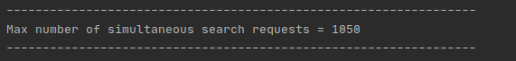

### 2. How is the latency of your solution affected by the number of simultaneous search requests?

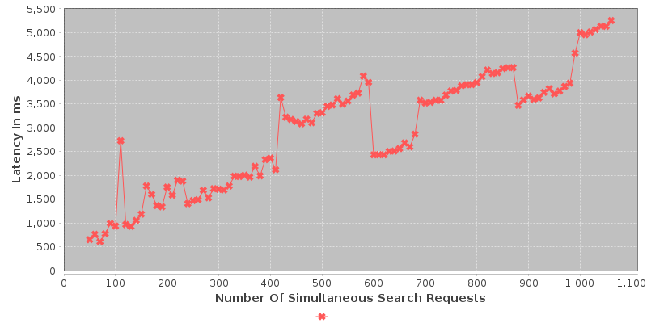

### 3. How is the search request latency of your solution affected by the number of web pages crawled?

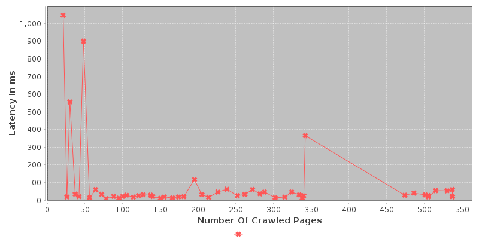

### 4. How is the search request latency of your solution affected by the size of the index table?

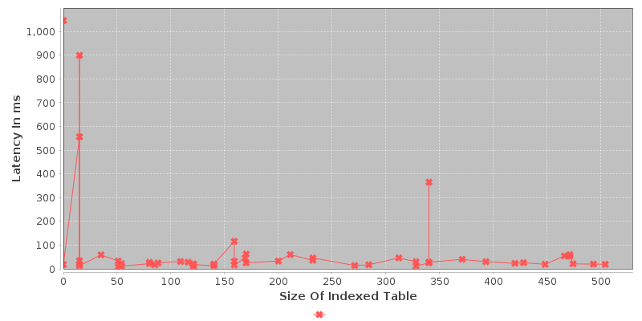

### 5. How is the search request latency of your solution affected by the ranking process?

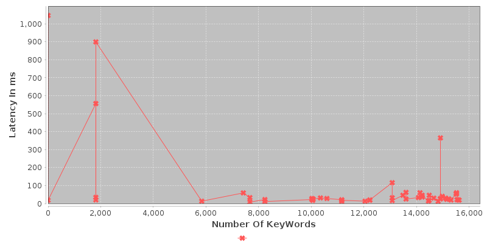

## Analysis with 5000 pages

This analysis has been made with this parameters using [Performance Analysis](/src/performance_analysis/PerformanceAnalysis.java) module

```
public static final int MAX_WEBSITES = 5000;
public final static int SECONDS_TO_SLEEP = 120;
```

### 1. How many simultaneous search requests can your solution handle?


### 2. How is the latency of your solution affected by the number of simultaneous search requests?

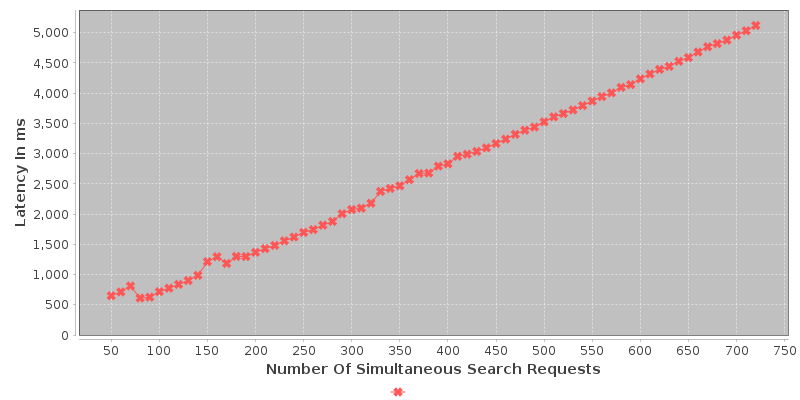

### 3. How is the search request latency of your solution affected by the number of web pages crawled?

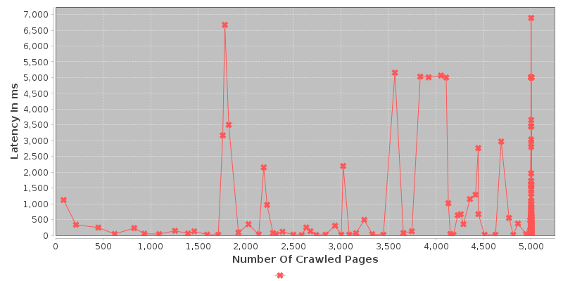

### 4. How is the search request latency of your solution affected by the size of the index table?

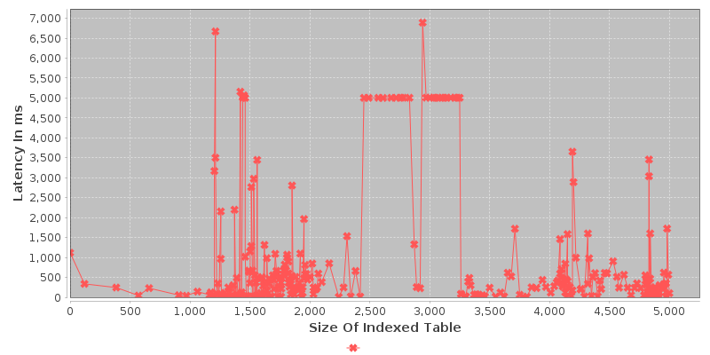

### 5. How is the search request latency of your solution affected by the ranking process?

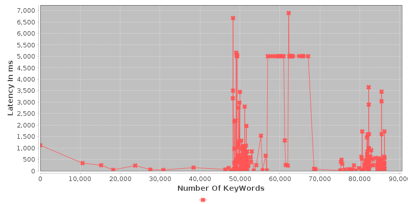

# :fire: Spidey On The Action

## Search By Text

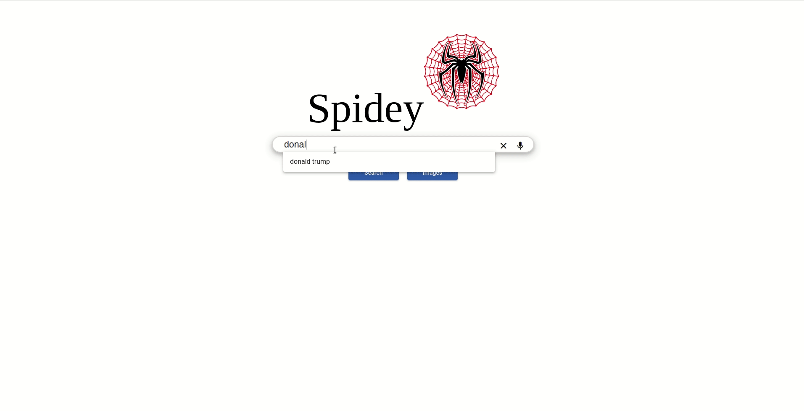

## Navigate Result Pages


## Search By Voice


## Search For Images

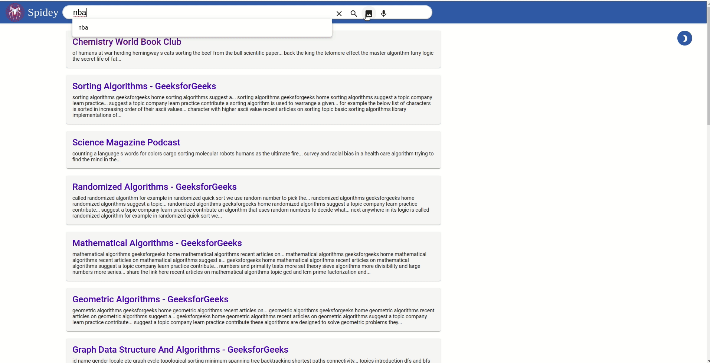

## Night Mode

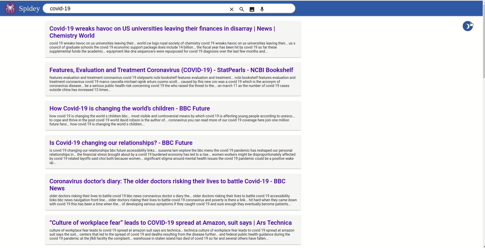

# :copyright: Developers

<center>
  
| Name                                |              Email               |
| ----------------------------------- | :------------------------------: |
| Abdulrahman Khalid Hassan           | abdulrahman.elshafei98@gmail.com |
| Shady Fahmy Abd Elhafez             |       Shadyfahmy67@gmail.com     |
| AbdElRahman Muhammad Ahmad ElGamil  |     abdurrumanmohamed@gmail.com  |
| Yosry Mohammad Yosry                |         yosrym93@gmail.com       |

</center>
